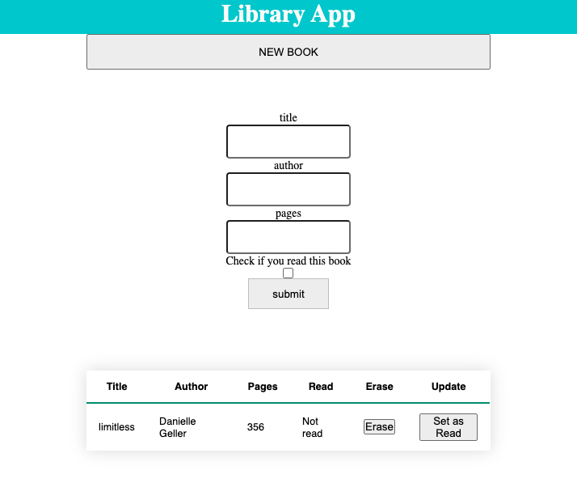

# Library-App 🚀

> Library App. This App is a place where you can save the books that you have read or you want to read.

### Live Demo [HERE](https://rawcdn.githack.com)

## Features 

- Submit new Books.
- Remove Registered Books.
- Change the Read to Unread status of the book.

## Built With

- HTML5
- CSS3
- Javascript

## Getting Started

To get a local copy up and running follow these simple steps.

- Clone this repository
- Navigate to the Repo Folder
- Use your favorite browser the index.html file (located at the root)
- Warning: This project use localStorage to store the books, be aware that the registered books will be only available on the browser it was registered.

## Author

👤 **Jasem Valencia**

- Github: [JasemDuncan](https://github.com/JasemDuncan)
- Twitter: [JasemValencia](https://twitter.com/JasemValencia)
- Linkedin: [JasemValencia](https://www.linkedin.com/in/jasem-duncan-valencia/)

## 🤝 Contributing

Contributions, issues and feature requests are welcome!

Feel free to check the [issues page](issues/).

## Show your support

Give a ⭐️ if you like this project!